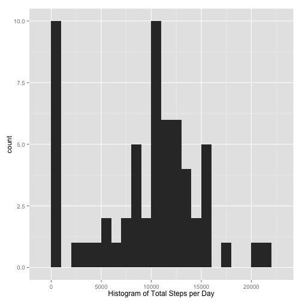
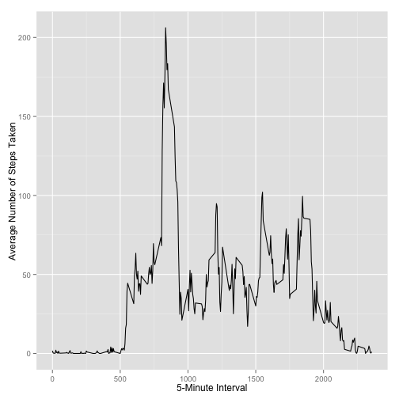
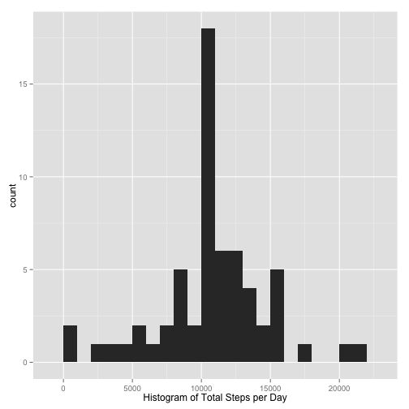

## Loading and preprocessing the data

```r
unzip(zipfile="activity.zip")
data <- read.csv("activity.csv")
```


## What is mean total number of steps taken per day?

```r
library(dplyr)
aggr_steps <- data %>%
  group_by(date) %>%
  summarize(total_steps = sum(steps, na.rm = TRUE))
library(ggplot2)
qplot(aggr_steps$total_steps, 
      binwidth = 1000, 
      xlab="Histogram of Total Steps per Day", 
      geom="histogram")
```

 

```r
mean(aggr_steps$total_steps, na.rm = TRUE)
```

```
## [1] 9354.23
```

```r
median(aggr_steps$total_steps, na.rm = TRUE)
```

```
## [1] 10395
```

## What is the average daily activity pattern?

```r
library(dplyr)
average_5min_steps <- data %>%
  group_by(interval) %>%
  summarize(average_steps = mean(steps, na.rm = TRUE))
ggplot(average_5min_steps,
       aes(average_5min_steps$interval,
           average_5min_steps$average_steps)) + 
    geom_line() + 
    xlab("5-Minute Interval") +
    ylab("Average Number of Steps Taken")
```

 

On average across all the days in the dataset, the 5-minute interval contains
the maximum number of steps?

```r
average_5min_steps[(which.max(average_5min_steps$average_steps)),]
```

```
## Source: local data frame [1 x 2]
## 
##   interval average_steps
## 1      835      206.1698
```

## Imputing missing values
What is the number of rows with missing data?

```r
missing <- is.na(data$steps)
# How many missing
table(missing)
```

```
## missing
## FALSE  TRUE 
## 15264  2304
```
Fill in the missing values with the average for the 5-minute interval

```r
fill_data <- data
fill_data$steps <- ifelse(is.na(fill_data$steps), average_5min_steps$average_steps, fill_data$steps)
library(dplyr)
fill_aggr_steps <- fill_data %>%
  group_by(date) %>%
  summarize(total_steps = sum(steps))
```
Create a histogram of the total number of steps in each day.

```r
library(ggplot2)
qplot(fill_aggr_steps$total_steps, 
      binwidth = 1000, 
      xlab="Histogram of Total Steps per Day", 
      geom="histogram")
```

 

Calculate the mean and median of the total number of steps

```r
mean(fill_aggr_steps$total_steps, na.rm = TRUE)
```

```
## [1] 10766.19
```

```r
median(fill_aggr_steps$total_steps, na.rm = TRUE)
```

```
## [1] 10766.19
```

The values are different because instead of omitting the replaced values, they are replaced with a 
## Are there differences in activity patterns between weekdays and weekends?

```r
fill_data$day <- weekdays(as.Date(fill_data$date))
fill_data$day_type <- ifelse(fill_data$day %in% c("Monday", "Tuesday", "Wednesday", "Thursday", "Friday"),
                        "weekday", 
                        "weekend")
aggdate <- aggregate(steps~interval + day_type, data = fill_data, mean)
ggplot(aggdate, aes(interval, steps)) + geom_line() + facet_grid(day_type ~ .) +
    xlab("5-minute interval") + ylab("Number of steps")
```

 

